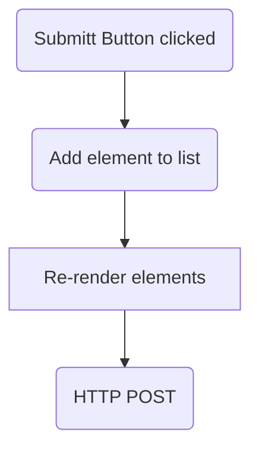
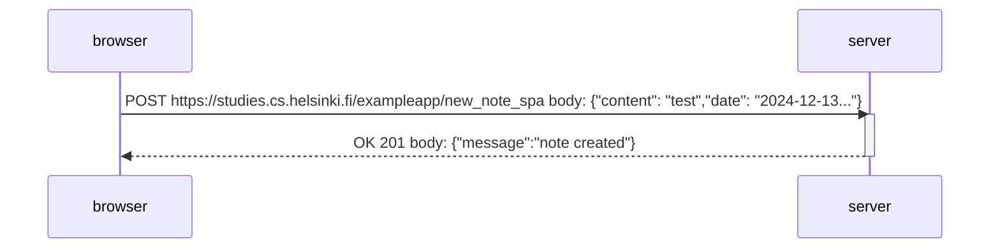

## User clicks save button.

```mermaid
graph TD
    B(Submitt Button clicked) --> C(Add element to list)
    C --> D(Redraw dom/update list)
    D[Re-render elements] --> E(HTTP POST)
```
## HTTP POST

```mermaid
sequenceDiagram
    participant browser
    participant server

    browser->>server: POST https://studies.cs.helsinki.fi/exampleapp/new_note_spa body: {"content": "test","date": "2024-12-13..."}
    activate server
    server-->>browser: OK 201 body: {"message":"note created"}
    deactivate server
```
